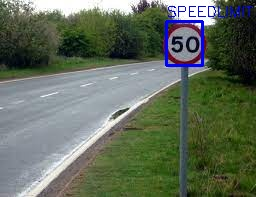
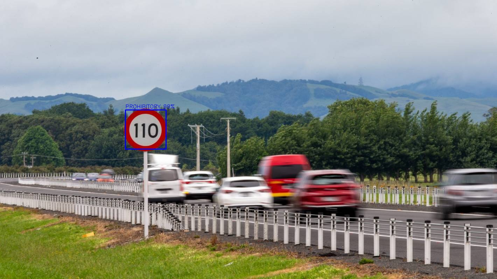
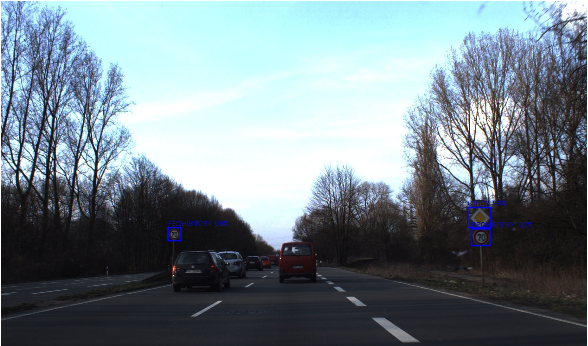
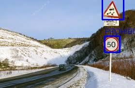
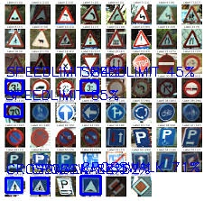

# Traffic-sign-recognization-using-CNN
convolutional neural net based traffic sign detection and classification using germen dataset of traffic signs and

This repository contains my upgraded version of [using YoloV3 net to detect objects](https://github.com/fredotran/yolov3-opencvdnn) by training a YoloV4 model to recognize and detect **4 specific classes of traffic signs** : 

* Traffic lights.
* Speedlimit.
* Crosswalk.
* Stop signs.

---

## About the dataset.

### Images.
This [dataset](https://www.kaggle.com/andrewmvd/road-sign-detection) contains **877 images** of **4 distinct classes** for the purpose of traffic sign detection.
I transformed the data in **YoloV4 format** to make it easier for this project (using [roboflow](https://roboflow.com/)), you can download my YOLOv4 format version of the dataset **[here](https://github.com/fredotran/traffic-signs-detection/releases/download/weights/Traffic.Road.Signs.YoloV3.format.v2-10-01-2021.darknet.zip)**. 

### Labels.

Each images contained in the training, test and validation sets are labelled using the YoloV4 Format **i.e** : 
* One row per object
* Each row is `confidenceProbability, x_center, y_center, width, heigh, classProbability...`
* If there is more than one class, each row will be `confidenceProbability, x_center, y_center, width, heigh, (1st)classProbability, (2nd)classProbability...(k)classProbability.`

--- 

## Requirements.
You can utilize GPU for better performance but this project based on low memory cunsumption and less frame rate.
these are the tools
* [Cmake](https://cmake.org/runningcmake/)
* [OpenCV 4.0 or higher](https://opencv.org/releases/) 
* [CUDA 11.0 or higher](https://developer.nvidia.com/cuda-toolkit-archive) 
* [cuDNN 7.0 or higher](https://developer.nvidia.com/rdp/cudnn-archive) 

these are nessesory tools.
* [Python3 or higher](https://www.python.org/downloads/)
* [Visual Studio 15 and higher](https://visualstudio.microsoft.com/fr/downloads/)
* [GPU with CudaCompiler](https://en.wikipedia.org/wiki/CUDA#GPUs_supported)
* Lot of patience 

### **Local version** : 

Before all, you'll first need to install and setup [OpenCV with a GPU back-end](https://medium.com/analytics-vidhya/build-opencv-from-source-with-cuda-for-gpu-access-on-windows-5cd0ce2b9b37), as we will need [OpenCV DNN GPU-enabled](https://learnopencv.com/how-to-use-opencv-dnn-module-with-nvidia-gpu-on-windows/) module : this is **mandatory**.  

* **If you want to train your own model** for this detection task you can do it as following :  
After the OpenCV installation in the root folder containing your `traffic-signs-detection` folder, you'll have to install and compile **[the darknet YoloV4](https://github.com/AlexeyAB/darknet)** algorithm in your workspace by doing these setups tutorial : [if you want to use cmake](https://github.com/AlexeyAB/darknet#how-to-compile-on-windows-using-cmake), and this one [if you want to use vcpkg](https://github.com/AlexeyAB/darknet#how-to-compile-on-windows-using-vcpkg). All the steps to setup and train your custom model are very well explained in [AlexeyAB repository](https://github.com/AlexeyAB/darknet) so I will not going in details here. The `backup` folder generated will store your trained weights.

## Training and evaluate our custom model.

(**Local version**) : Now, you can start to train our custom model. In order to see if your [darknet installation](https://github.com/AlexeyAB/darknet) is working on Windows. To do that, you'll just have to launch a `Windows PowerShell Console`, go to the `traffic-signs-detection` folder and type the following command : 
* `.\darknet.exe detector train ../data/obj.data ../cfg/[CONFIG].cfg ../weights/[WEIGHTS].weights -map` 

Needlessly to tell you to replace `CONFIG` and `WEIGHTS` by the **own** names you gave to these files ([more infos here](https://github.com/AlexeyAB/darknet#when-should-i-stop-training)).

To test your custom model, this is the same steps to do than training but instead you have to enter this command : 
* `.\darknet.exe detector test ../data/obj.data ../cfg/[CONFIG].cfg ../weights/[WEIGHTS].weights -map` 

(Again) needlessly to tell you to replace `CONFIG` and `WEIGHTS` by the **own** names you gave to these files ([more infos here](https://github.com/AlexeyAB/darknet#custom-object-detection)).

---

## Notebooks.

In case or you want to test the custom model using **Jupyter Notebooks**, I'm providing two notebooks [for images testings](https://github.com/Pritesh24gurjar/Traffic-sign-recognization-using-CNN/blob/main/Traffic_Sign_Classifier.ipynb) and [for videos testings](https://github.com/Pritesh24gurjar/Traffic-sign-recognization-using-CNN/blob/main/video_test_smulator.ipynb).

The [`inputs`](https://github.com/Pritesh24gurjar/Traffic-sign-recognization-using-CNN/tree/main/images) folder contains images and videos for testing your custom model, feel free to add more images/videos you're finding relevant ! The [`results`](https://github.com/Pritesh24gurjar/Traffic-sign-recognization-using-CNN/tree/main/output) folder contains the outputs of our custom model when we input images and videos from the `inputs` folder.

Using the notebooks for images, we can show some of the results : 

  
 
 

---

## Acknowledgements.

Thank you Neev shirke , malay khakkar , navin bubna for their incredible work on **YOLO object detector** : **[YOLOv3: An Incremental Improvement]
