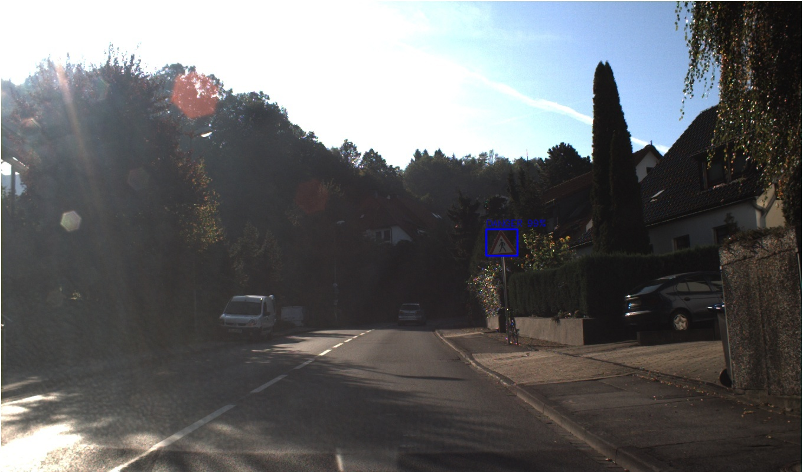

# 🚦 Traffic Sign Recognition using CNN and YOLOv4

This repository showcases a CNN-based traffic sign detection and classification system using the German Traffic Sign dataset, enhanced with YOLOv4 for real-time object detection.


We upgraded the original [YOLOv3 implementation](https://github.com/fredotran/yolov3-opencvdnn) to use **YOLOv4**, enabling more accurate recognition of the following traffic sign classes:

- 🚫 **Prohibitory**
- ⛔ **Mandatory**
- ⚠️ **Other**

---

## 📁 Dataset

### 📷 Images

We use the [Road Sign Detection dataset](https://www.kaggle.com/andrewmvd/road-sign-detection) with **877 images** covering **4 traffic sign categories**. The dataset was reformatted using [Roboflow](https://roboflow.com/) to match the YOLOv4 input requirements.

🔗 **Download YOLOv4 formatted dataset:**  
[Traffic Signs Dataset (YOLOv4)](https://github.com/fredotran/traffic-signs-detection/releases/download/weights/Traffic.Road.Signs.YoloV3.format.v2-10-01-2021.darknet.zip)

### 🏷️ Labels

Labels follow the YOLO format:
- Each line: `class x_center y_center width height`
- Normalized values (0–1)

---

## ⚙️ Requirements

You can run this on GPU for better performance. The system is optimized for low memory consumption and modest frame rates.

### System Tools
- [CMake](https://cmake.org/runningcmake/)
- [OpenCV 4.0+](https://opencv.org/releases/)
- [CUDA 11.0+](https://developer.nvidia.com/cuda-toolkit-archive)
- [cuDNN 7.0+](https://developer.nvidia.com/rdp/cudnn-archive)

### Programming Tools
- [Python 3+](https://www.python.org/downloads/)
- [Visual Studio 2017+](https://visualstudio.microsoft.com/fr/downloads/)
- GPU with CUDA support  
- Plenty of ☕ patience

---

## 🖥️ Local Setup

You **must** install OpenCV with GPU backend:

📚 Follow this guide to install OpenCV with GPU support:  
[Build OpenCV with CUDA (Windows)](https://medium.com/analytics-vidhya/build-opencv-from-source-with-cuda-for-gpu-access-on-windows-5cd0ce2b9b37)

Then clone and build [Darknet YOLOv4](https://github.com/AlexeyAB/darknet):

- [CMake Setup Instructions](https://github.com/AlexeyAB/darknet#how-to-compile-on-windows-using-cmake)
- [VCPKG Setup Instructions](https://github.com/AlexeyAB/darknet#how-to-compile-on-windows-using-vcpkg)

---

## 🧠 Train and Evaluate Your Model

### Training

```bash
.\darknet.exe detector train ../data/obj.data ../cfg/[CONFIG].cfg ../weights/[WEIGHTS].weights -map
```

Replace `[CONFIG]` and `[WEIGHTS]` with your actual file names.

📖 More info: [When should I stop training](https://github.com/AlexeyAB/darknet#when-should-i-stop-training)

### Testing

```bash
.\darknet.exe detector test ../data/obj.data ../cfg/[CONFIG].cfg ../weights/[WEIGHTS].weights -map
```

📖 More info: [Custom object detection](https://github.com/AlexeyAB/darknet#custom-object-detection)

---

## 📓 Notebooks

Test the model in **Jupyter Notebooks**:

- 📷 [Test on Images](https://github.com/Pritesh24gurjar/Traffic-sign-recognization-using-CNN/blob/main/Traffic_Sign_Classifier.ipynb)  
- 🎞️ [Test on Video](https://github.com/Pritesh24gurjar/Traffic-sign-recognization-using-CNN/blob/main/video_test_smulator.ipynb)

### Folders
- [`images/`](https://github.com/Pritesh24gurjar/Traffic-sign-recognization-using-CNN/tree/main/images) – Input images/videos
- [`output/`](https://github.com/Pritesh24gurjar/Traffic-sign-recognization-using-CNN/tree/main/output) – Detection results

### Sample Results





---

## 🙏 Acknowledgements

Thanks to:
- **Neev Shirke**
- **Malay Khakkar**
- **Navin Bubna**

For their incredible work on YOLO object detection.
